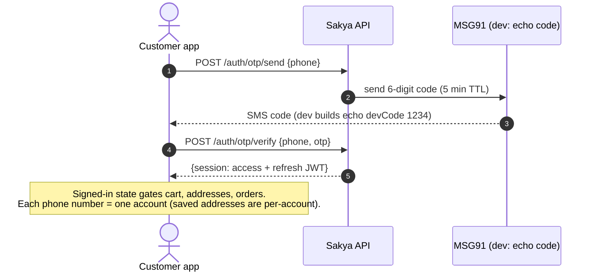
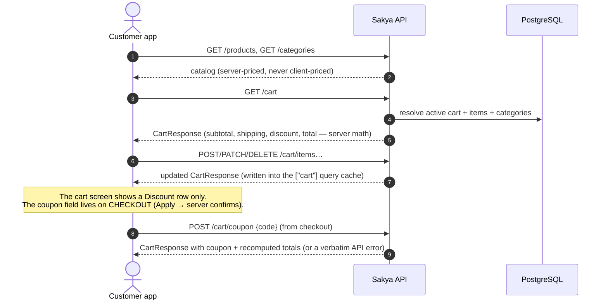
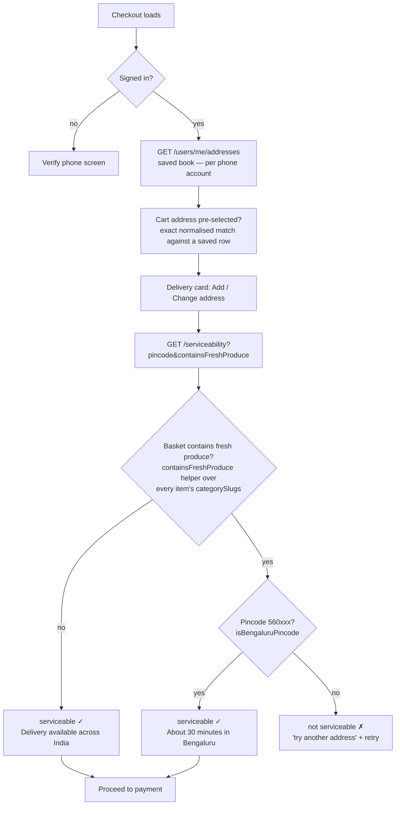
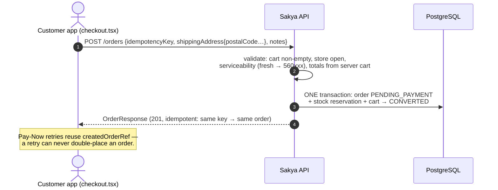
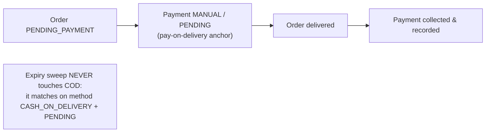
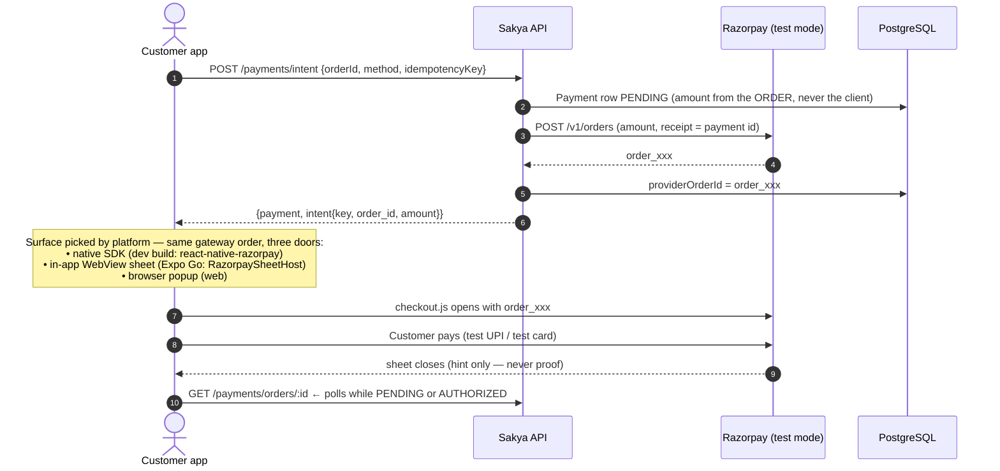
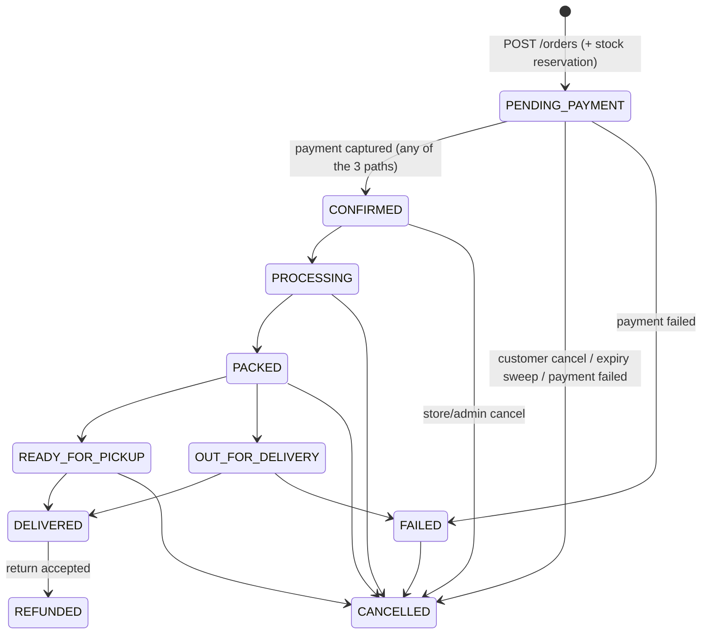

# System flow — backend + customer app

The complete, current flow of the Sakya Farms platform: what the customer app
does, what the API does, and how money and stock move safely between them.
Every diagram reflects the code as it runs today (Razorpay **test mode**,
Bengaluru-only fresh produce, pull-based payment reconciliation).

**Runtime pieces**

| Piece                                              | Runs as                                        |
| -------------------------------------------------- | ---------------------------------------------- |
| API — `apps/api`                                   | `node dist/main.js` on `:3000`, routes `/api/v1` (build first: `pnpm --filter @sakya/api build`) |
| Customer app — `apps/customer`                     | Expo (dev build / Expo Go / web), `EXPO_PUBLIC_API_URL` points at the API |
| Razorpay                                           | Test keys (`rzp_test_…`), webhook secret on the API, **auto-capture off → the API captures explicitly** |
| PostgreSQL                                         | Single source of truth; only the API talks to it |

---

## 1. Sign-in — phone OTP



---

## 2. Catalog, cart and coupon



---

## 3. Address + serviceability (the "not serviceable" gate)



The **same rule** is enforced twice so the UI and the order gate can never
disagree:

- UI: `GET /serviceability` (and `POST /serviceability/check`) → `serviceable = !containsFreshProduce || isBengaluruPincode`
- Server: `orders.service` throws *"Fresh fruits and vegetables are currently delivered within Bengaluru only."* before any order row exists.

Fresh-slug detection lives in **one** place: `packages/utils/src/delivery.ts`
(`FRESH_PRODUCE_CATEGORY_SLUGS` + `containsFreshProduce`) — every catalog slug
(`all-fresh`, `sakya-fresh`, `roots-others-copy`, …) is covered and pinned by
regression tests.

---

## 4. Checkout → order placement



- Stock is **reserved** with the order and held for `PENDING_ORDER_EXPIRY_MINUTES` (120 min).
- `shippingAddress.postalCode` is the field name (not `pincode`), endpoint is `POST /orders`.
- COD stops here (section 5a). Online methods continue to the payment intent.

---

## 5. Payment — the money flow

### 5a. Cod — anchored, settled on delivery



### 5b. Online (UPI / Card) — intent, gateway, capture



### 5c. Confirmation — three paths to CAPTURED

```mermaid
flowchart TD
    S[Gateway payment exists for order_xxx] --> W[PATH 1 — Webhook<br/>POST /payments/webhook/razorpay<br/>HMAC signature verified]
    S --> P[PATH 2 — Pull reconcile<br/>order screen polls GET /payments/orders/:id<br/>every 1.5s × 20 while unresolved]
    S --> X[PATH 3 — Expiry sweep<br/>every 5 min, before cancelling anything]

    W --> M[processWebhookEvent — the ONE state machine]
    P --> R[reconcilePayment: ask Razorpay<br/>orders/:id/payments]
    X --> R

    R --> Q{Gateway says}
    Q -- captured --> M
    Q -- authorized --> CP["capturePayment() → POST /payments/:id/capture<br/>(auto-capture is OFF; authorization would otherwise expire)"]
    CP --> R2[re-read status] --> M
    Q -- nothing decisive / unreachable --> N[return null — read still succeeds,<br/>next tick retries; AUTHORIZED money is NEVER cancelled]

    M --> T{Payment transition}
    T -- PENDING/AUTHORIZED → CAPTURED --> U[Payment CAPTURED + order CONFIRMED<br/>OrderStatusHistory + customer push]
    T -- → FAILED --> V[Order FAILED (retryable attempt kept on same gateway order)]

    U --> Z[Client sees captured row → navigates / banner "Order confirmed"]
```

Rules that make this safe:

- **One state machine.** Webhook, pull-reconcile and sweep all funnel through
  `processWebhookEvent` — amount/currency cross-check, replay handling,
  transition guard, order mirroring, notifications, identical in every path.
- **Nothing is invented locally.** The gateway's own answer (`fetchPaymentStatus`)
  is the only authority; a sheet closing is only a hint.
- **Authorized ≠ done.** `reconcilePayment` captures an authorization
  immediately (Razorpay auto-capture is off by default) and re-reads; a failed
  capture keeps the authorization and retries next poll/sweep.
- **No webhook needed in dev.** Razorpay cannot reach `localhost`, so path 2
  is what confirms test payments on a dev machine — the client polls, the
  server reconciles and captures.
- **Client polling stops only when resolved:** `paymentStatus` ∈ {PENDING,
  AUTHORIZED} → poll; CAPTURED/FAILED → stop. The UI never self-declares success.

---

## 6. Pending-order expiry sweep (money-safety critical)

```mermaid
flowchart TD
    CRON["Cron every 5 min<br/>orders PENDING_PAYMENT older than 120 min"] --> Q{COD anchor present?<br/>method=CASH_ON_DELIVERY + PENDING}
    Q -- yes --> SKIP1[Skip — COD is pending by design]
    Q -- no --> A{Any CAPTURED payment row?}
    A -- yes --> HEAL[Auto-heal: replay captured event<br/>→ order CONFIRMED, never cancelled]
    A -- no --> G{Gateway order exists?}
    G -- yes --> REC[reconcilePayment — ask Razorpay<br/>and CAPTURE if only authorized]
    REC -- money found --> KEEP1[Leave order alone]
    REC -- no answer --> AU{AUTHORIZED row in DB?}
    G -- no --> AU
    AU -- yes --> KEEP2[Re-apply authorized event (no-op)<br/>order survives; next tick retries]
    AU -- no --> CANCEL[Cancel order + write status history<br/>+ release stock reservation]
```

Never-cancel invariants: COD is skipped, captured money auto-heals, an
unreachable gateway skips the run, and AUTHORIZED money survives every run —
a wrong cancellation cannot be undone by waiting.

---

## 7. Order lifecycle (server-authoritative)



- Transitions are validated against `ORDER_STATUS_TRANSITIONS`
  (`packages/types/src/statuses.ts`) — a request body can never set a status
  directly; every write appends `OrderStatusHistory`.
- The order detail screen polls while the order is active (15 s) and
  additionally polls **payment rows** for a freshly placed online payment.

---

## 8. Where each flow lives in code

| Flow                          | Backend                                                        | Customer app                                                        |
| ----------------------------- | -------------------------------------------------------------- | ------------------------------------------------------------------- |
| OTP auth                      | `apps/api/src/modules/auth`                                     | `app/(auth)/*`, `src/stores/auth-store.ts`                          |
| Catalog / cart / coupon       | `modules/cart`, `modules/catalog`                              | `app/(shop)/components/AuthenticatedCartScreen.tsx`, checkout coupon card |
| Addresses                     | `modules/users` (`/users/me/addresses`)                        | `src/components/checkout/AddressPickerSheet.tsx`, `AddressSheet.tsx` |
| Serviceability (fresh rule)   | `modules/customer-journey`, gate in `modules/orders`           | `checkout.tsx` delivery card, `packages/utils/src/delivery.ts`       |
| Order placement               | `modules/orders/orders.service.ts`                             | `app/(shop)/checkout.tsx` (`handlePlaceOrder`, idempotent)          |
| Payment intent + webhooks     | `modules/payments` (service, webhook controller, providers)    | `src/lib/razorpay-checkout.ts`, `RazorpaySheetHost.tsx`             |
| Pull reconcile + capture      | `payments.service.listForOrder` / `reconcilePayment`           | `orders/[id].tsx` `useFreshOrderPolling`                            |
| Expiry sweep                  | `modules/orders/order-expiry.service.ts`                       | — (server-driven)                                                   |
| Order tracking                | `modules/orders` (status history)                              | `orders/[id].tsx`, `src/lib/order-tracking.ts`                      |

Related docs: [`payments-setup.md`](./payments-setup.md) (gateway credentials
and webhook setup), [`api-conventions.md`](./api-conventions.md) (envelopes and
errors), [`handoff.md`](./handoff.md) (project state and known gaps).
